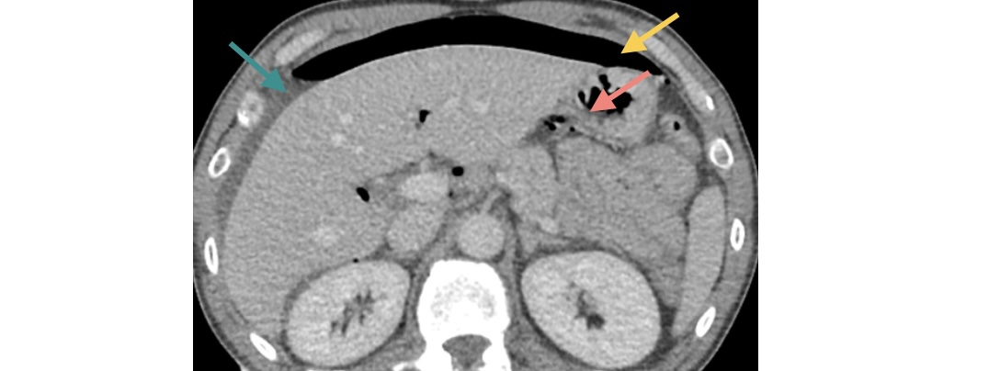
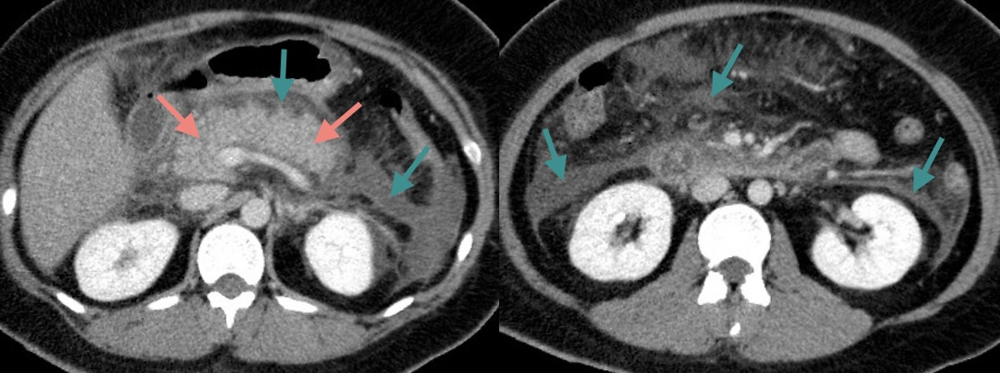
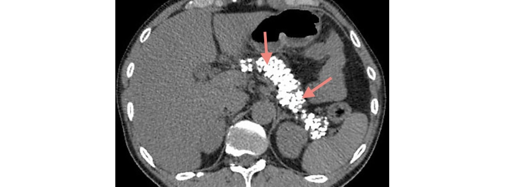
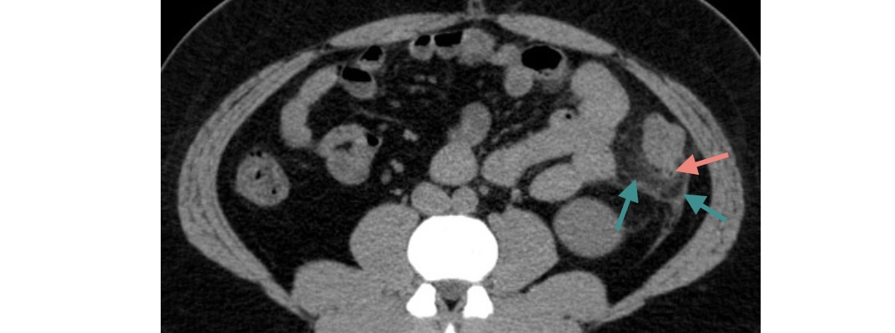

# Douleurs abdominales

:material-arrow-right: Fiches **LiSA** : [douleurs abdominales](https://livret.uness.fr/lisa/2024/Douleurs_abdominales_aigu%C3%ABs_chez_l%E2%80%99enfant_et_chez_l%E2%80%99adulte){:target="_blank"}, [lithiase biliaire](https://livret.uness.fr/lisa/2024/Lithiase_biliaire_et_complications){:target="_blank"}, [ulcère gastro-duodénal](https://livret.uness.fr/lisa/2024/Ulc%C3%A8re_gastrique_et_duod%C3%A9nal._Gastrite){:target="_blank"}, [pancréatite aiguë](https://livret.uness.fr/lisa/2024/Pancr%C3%A9atite_aigu%C3%AB){:target="_blank"}, [pancréatite chronique](https://livret.uness.fr/lisa/2024/Pancr%C3%A9atite_chronique){:target="_blank"}, [appendicite](https://livret.uness.fr/lisa/2024/Appendicite_de_l%E2%80%99enfant_et_de_l%E2%80%99adulte){:target="_blank"}, [diverticulite](https://livret.uness.fr/lisa/2024/Diverticulose_colique_et_diverticulite_aigu%C3%AB_du_sigmo%C3%AFde){:target="_blank"},  [MICI](https://livret.uness.fr/lisa/2024/Maladies_inflammatoires_chroniques_de_l%E2%80%99intestin_(MICI)_chez_l%E2%80%99adulte){:target="_blank"}, [ischémie intestinale](https://livret.uness.fr/lisa/2024/Art%C3%A9riopathie_de_l%E2%80%99aorte,_des_art%C3%A8res_visc%C3%A9rales_et_des_membres_inf%C3%A9rieurs_;_an%C3%A9vrysmes){:target="_blank"} et [traumatisme abdominal](https://livret.uness.fr/lisa/2024/Prise_en_charge_imm%C3%A9diate_pr%C3%A9-hospitali%C3%A8re_et_%C3%A0_l%E2%80%99arriv%C3%A9e_%C3%A0_l%E2%80%99h%C3%B4pital,_%C3%A9valuation_des_complications_chez_:_un_br%C3%BBl%C3%A9,_un_polytraumatis%C3%A9,_un_traumatis%C3%A9_thoracique,_un_traumatis%C3%A9_abdominal,_un_traumatis%C3%A9_des_membres_et/ou_du_...){:target="_blank"}

## Douleurs biliaires :nauseated_face:

!!! imago "[Cholécystite](https://radiopaedia.org/cases/42795/studies/45969){:target="_blank"}"
    * _Echographie de la vésicule biliaire_
    * Parois vésiculaires épaissies (6 mm) et feuilletées
    * Calcul de 14 mm enclavé dans le collet (cône d'ombre postérieur)
    <figure markdown="span">
        {width="600"}
    </figure>
    !!! lumos ""
        :fire: Le signe principal est la **douleur au passage de la sonde** échographique

!!! imago "[Angiocholite](https://radiopaedia.org/cases/31089/studies/31792){:target="_blank"}"
    * _Cholangio-IRM et séquences T2 coronale, axiale et oblique_
    * Dilatation du cholédoque et des voies biliaires intra-hépatiques
    * Innombrables calculs millimétriques dans la vésicule biliaire
    * Empierrement cholédocien : calculs enclavés dans sa partie distale  
    <figure markdown="span">
        {width="600"}
    </figure>
    !!! lumos ""
        :fire: Triade **douleur - fièvre - ictère** apparaissant successivement sur 48h

## Douleurs épigastriques :custom-stomach: :custom-pancreas:

!!! imago "[Perforation d'ulcère gastrique](https://radiopaedia.org/cases/69263/studies/79054){:target="_blank"}"
    * _Scanner abdomino-pelvien injecté au temps veineux_
    * Pneumopéritoine sus-mésocolique et épanchement périhépatique
    * Défaut de rehaussement focal de la petite courbure gastrique
    <figure markdown="span">
        {width="600"}
    </figure>

!!! imago "[Pancréatite aiguë](https://radiopaedia.org/cases/69236/studies/79012){:target="_blank"}"
    * _Scanner abdomino-pelvien injecté au temps veineux_
    * Elargissement diffus du pancréas
    * Infiltration liquidienne péripancréatique, mésentérique et pararénale ant. bilatérale
    <figure markdown="span">
        {width=600"}
    </figure>
    !!! lumos ""
        :fire: Gravité = **TDM à J3-J5** (score CTSI : nécrose pancréatique et collections)

!!! imago "[Pancréatite chronique](https://radiopaedia.org/cases/67773/studies/77187){:target="_blank"}"
    * _Scanner abdominal sans injection_
    * Innombrables calcifications disséminées dans le pancréas
    <figure markdown="span">
        {width=600"}
    </figure>
    !!! lumos ""
        :fire: FDR = consommation importante d'**alcool** pendant > 10 ans et tabagisme

## Douleurs intestinales :poop:

!!! imago "[Appendicite](https://radiopaedia.org/cases/85904/studies/101771){:target="_blank"}"
    * _Echographie de la fosse iliaque droite_ 
    * Appendice de naissance latéro-cæcal interne
    * Base appendiculaire fine contrastant avec un élargissement de sa pointe
    * Hypervascularisation Doppler au pourtour de la pointe
    <figure markdown="span">
        {width=600"}
    </figure>
    !!! lumos ""
        :fire: Le signe principal est la **douleur au passage de la sonde** échographique

!!! imago "[Diverticulite](https://radiopaedia.org/cases/39843/studies/42299){:target="_blank"}"
    * _Scanner abdomino-pelvien sans injection_
    * Infiltration de la graisse en flanc gauche autour d'un diverticule colique 
    * Pas d'épanchement, de collection péritonéale, ni de pneumopéritoine
    <figure markdown="span">
        {width=600"}
    </figure>
    !!! lumos ""
        :fire: Diverticulite non compliquée = **traitement symptomatique** en ambulatoire

!!! imago "[Maladie de Crohn](https://radiopaedia.org/cases/92628/studies/110674){:target="_blank"}"
    * _Scanner abdomino-pelvien après ingestion et injection au temps veineux_
    * Epaississement pariétal de l'**iléon distal** avec rehaussement de la muqueuse
    * Aspect « en peigne » des vaisseaux mésentériques traduisant une hyperhémie
    * Adénomégalies mésentériques
    <figure markdown="span">
        {width=600"}
    </figure>

!!! imago "[Infarctus mésentérique](https://radiopaedia.org/cases/97143/studies/117155){:target="_blank"}"
    * _Scanner abdomino-pelvien sans puis après inj. aux temps artériel et veineux_
    * Thrombose de l'artère mésentérique supérieure (cf. arrêt brutal en sagittal MIP)
    * Défaut de rehaussement des anses iléales (au temps veineux)
    * Aéroportie
    <figure markdown="span">
        {width=600"}
    </figure>

## Quiz

??? question "[Homme de 25 ans, traumatisme lors d'un match de football](https://radiopaedia.org/cases/53703/studies/59763){:target="_blank"}"
    * _Scanner abdomino-pelvien après inj. aux temps artériel et veineux_
    * Hémopéritoine de grande abondance
    * Lacérations spléniques s'étendant d'un bord à l'autre
    * Atteinte du hile splénique sans saignement actif décelable
    <figure markdown="span">
         
        {width=600"}
        
:star: Rupture traumatique de la rate :star:

    </figure>