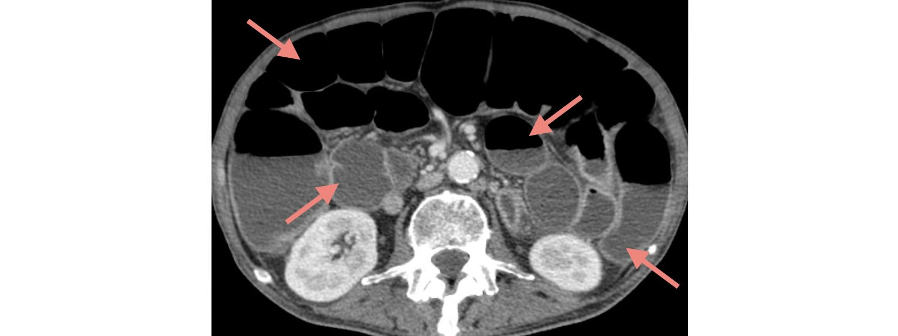
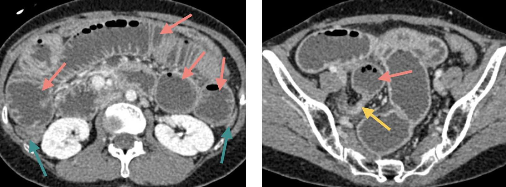
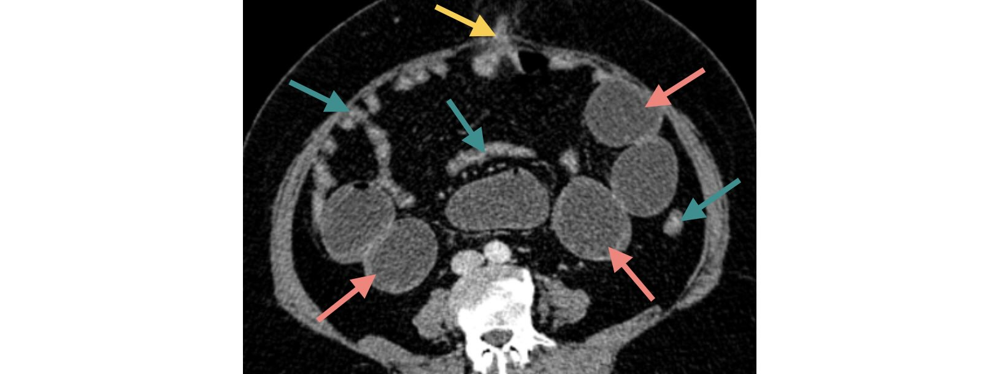
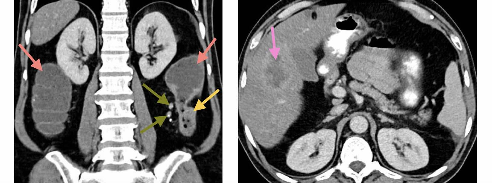
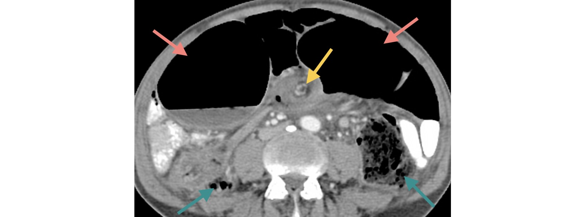
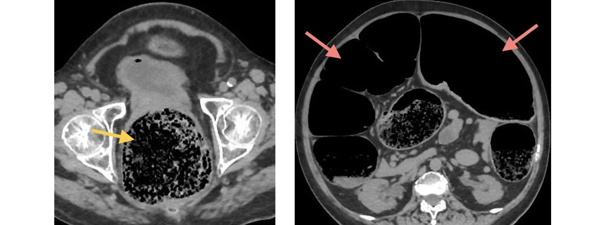
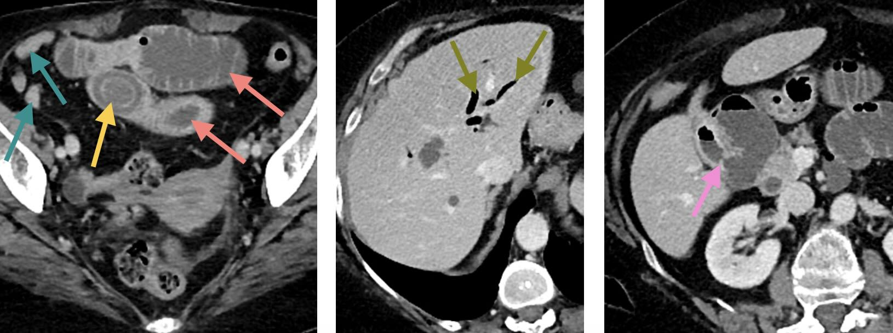
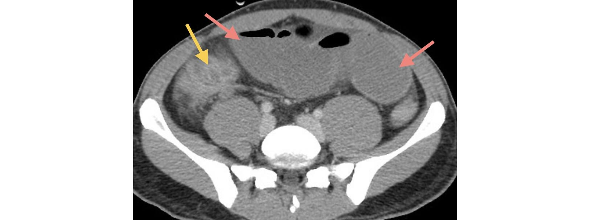
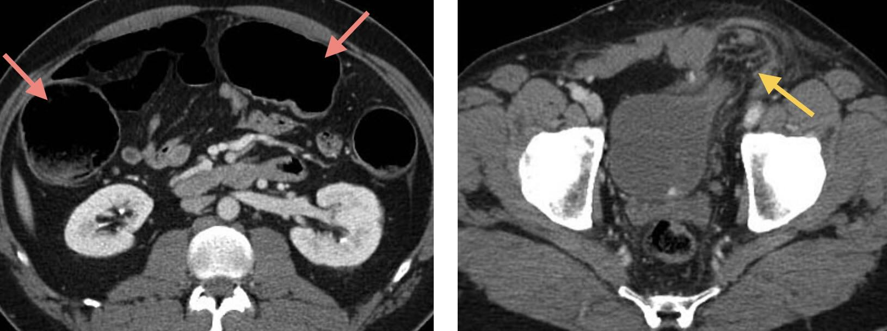

# Syndrome occlusif

:material-arrow-right: [Fiche **LiSA**](https://livret.uness.fr/lisa/2024/Syndrome_occlusif_de_l%E2%80%99enfant_et_de_l%E2%80%99adulte){:target="_blank"}  

## Fonctionnel :snake:

!!! imago "[Iléus paralytique](https://radiopaedia.org/cases/33988/studies/35206){:target="_blank"}"
    * _Scanner abdomino-pelvien au temps veineux et reconstruction volumique_
    * Dilatation diffuse des anses intestinales (pas de jonction plat-dilaté)
    <figure markdown="span">
        {width="600"}
    </figure>
    !!! lumos ""
        :fire: Causes nombreuses : opioïdes, hypokaliémie, péritonite, post-laparotomie, ...

## Mécanique :balloon:

!!! lumos ""
    :fire: Occlusion mécanique = **jonction intestin plat / intestin dilaté**

!!! imago "[Occlusion haute sur bride](https://radiopaedia.org/cases/48397/studies/53305){:target="_blank"}"
    * _Scanner abdomino-pelvien injecté au temps veineux_
    * Dilatation marquée d'anses grêles contrastant avec un côlon plat
    * Syndrome jonctionnel dans le pelvis avec anse grêle plate en aval
    * **Rehaussement satisfaisant des parois** des anses grêles dilatées
    <figure markdown="span">
        {width="600"}
    </figure>
    !!! lumos ""
        :fire: **Bride** = 80% des occlusions gréliques (antécédent chirurgical +++)

!!! imago "[Hernie ombilicale étranglée](https://radiopaedia.org/cases/90649/studies/108059){:target="_blank"}"
    * _Scanner abdomino-pelvien injecté au temps veineux_
    * Dilatation d'anses grêles en amont d'une hernie ombilicale
    * En aval les anses intestinales sont plates
    <figure markdown="span">
        {width="600"}
    </figure>

!!! lumos ""
    :fire: 80% des occlusions mécaniques sont **gréliques**

!!! imago "[Occlusion basse sur cancer](https://radiopaedia.org/cases/88301/studies/104929){:target="_blank"}"
    * _Scanner abdomino-pelvien injecté au temps veineux_
    * Dilatation du côlon en amont d'un épaississement sténosant du côlon gauche
    * Adénopathies dans le mésocôlon et métastase hépatique nécrotique
    <figure markdown="span">
        {width="600"}
    </figure>
    !!! lumos ""
        :fire: **Cancer** = 60% des occlusions mécaniques coliques

!!! imago "[Volvulus du sigmoïde](https://radiopaedia.org/cases/181461/studies/144953){:target="_blank"}"
    * _Scanner après ingestion et administration intrarectale de produit de contraste_
    * Opacification de la lumière des anses grêles et du rectum
    * Pas de passage du produit de contraste dans le côlon
    * Dilatation très marquée du sigmoïde et cadre colique modérément dilaté
    * Enroulement du sigmoïde et du mésentère
    <figure markdown="span">
        {width="600"}
    </figure>
    !!! lumos ""
        :fire: Aspect en **grain de café sur l'ASP** (ou ici le topogramme)

## Quiz

??? question "[Femme de 70 ans, douleurs abdominales, constipation](https://radiopaedia.org/cases/167017/studies/135758){:target="_blank"}"
    * _Scanner abdomino-pelvien sans et après inj. aux temps veineux et excréteur_
    * Dilatation du côlon en amont d'un amas de matières fécales dans le rectum
    <figure markdown="span">
         
        {width=600"}
        
:star: Fécalome :star:

    </figure>
    !!! lumos ""
        :fire: 1ère cause d'occlusion colique chez le vieux alité : **TR** indispensable

??? question "[Femme de 75 ans, douleurs abdominales et vomissements](https://radiopaedia.org/cases/c9013cea9e488dcfa503c4d82632bb9b/studies/148307?lang=gb){:target="_blank"}"
    * _Scanner abdomino-pelvien injecté au temps veineux_
    * Occlusion mécanique du grêle avec jonction plat-dilaté dans le pelvis
    * Formation ovalaire avec liseré hyperdense périphérique immédiatement en amont
    * Aérobilie et fistule entre la vésicule biliaire et le 2ème duodénum
    <figure markdown="span">
         
        {width=600"}
        
:star: Iléus biliaire :star:

    </figure>
    !!! lumos ""
        :fire: Complique rare de la cholécystite chronique

??? question "[Homme de 30 ans, douleurs et distension abdominales, CRP élevée](https://radiopaedia.org/cases/79128/studies/92090){:target="_blank"}"
    * _Scanner abdomino-pelvien injecté au temps veineux_
    * Dilatation grélique en amont d'un épaississement sténosant de la dernière anse iléale
    <figure markdown="span">
         
        {width=600"}
        
:star: Occlusion grélique sur iléite terminale :star:

    </figure>
    !!! lumos ""
        :fire: Causes d'iléite terminale : maladie de **Crohn**, tuberculose, *Yersinia*

??? question "[Homme de 55 ans, douleurs abdominales](https://radiopaedia.org/cases/98026/studies/118470){:target="_blank"}"
    * _Scanner abdomino-pelvien injecté au temps artériel_
    * Dilatation colique en amont d'une hernie inguino-scrotale gauche
    <figure markdown="span">
         
        {width=600"}
        
:star: Occlusion colique sur hernie étranglée :star:

    </figure>
    !!! lumos ""
        :fire: La hernie inguinale est beaucoup plus fréquente chez l'**homme**