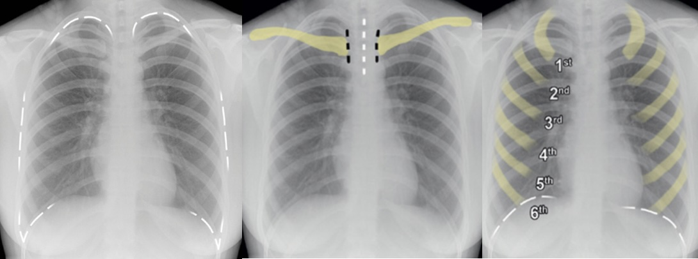
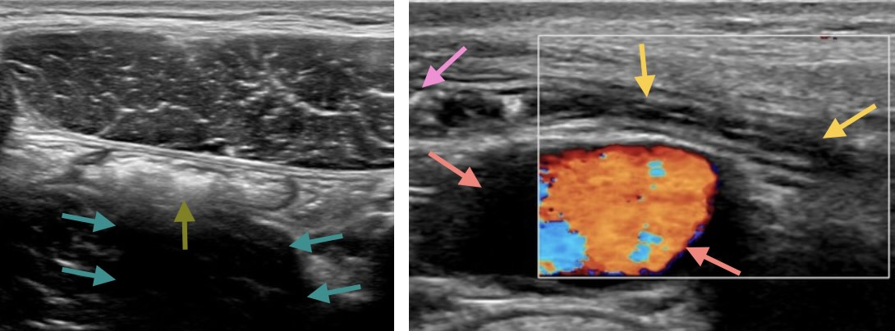
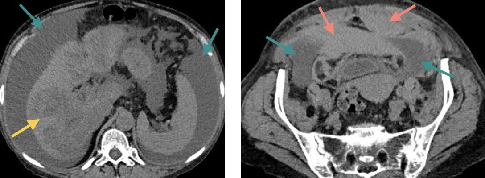
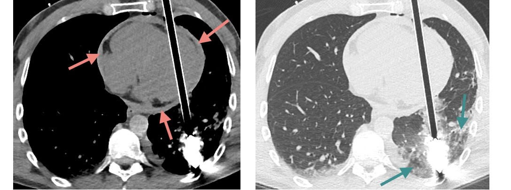
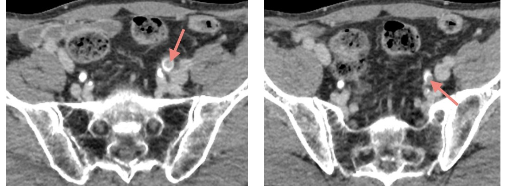
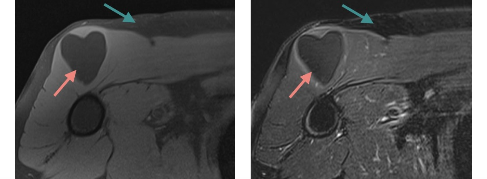
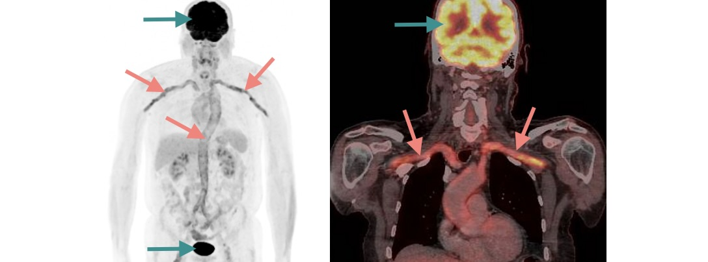

# Modalités d'imagerie

« Trouvons la cause, nous trouverons le remède » <i>Hippocrate (IVème s. av. J-C)</i>

## Radiographie standard :radioactive:

!!! imago "[Opacité pulmonaire acrobatique](https://radiopaedia.org/cases/21812/studies/21768){:target="_blank"}"
    Une radiographie thoracique est réalisée autant que possible debout, en incidence postéro-antérieure (sinon élargissement de la silhouette cardiaque), et après avoir **enlevé les bijoux et autre matériel** responsable d'opacités (ici piercing au téton).
    !!! lumos ""
        :fire: Critères de qualité : champ d'acquisition complet, cliché centré, inspiration profonde
    <figure markdown="span">
        {width="600"}
    </figure>   

## Echographie :white_check_mark:

:child_tone1: À privilégier chez l'enfant et la femme enceinte :pregnant_woman:  
:warning: Peu contributive en cas d'**obésité** :hamburger:

!!! imago "[Appendice normal](https://radiopaedia.org/cases/82014/studies/95999){:target="_blank"}"
    * Structure borgne appendue au bas fond cæcal croisant généralement l'artère iliaque ext.
    * Normalement < 7 mm, compressible, sans douleur au passage de la sonde en regard
    * Souvent non visualisable en raison d'interpositions digestives aériques
    !!! lumos ""
        :fire: Cône d'ombre postérieur = air ou calcification
    <figure markdown="span">
        {width="600"}
    </figure>   

## Scanner :radioactive:

:pregnant_woman:  Eliminer une **grossesse** chez le femme en âge de procréer :x:   
:warning: Contre-indications aux **produits de contraste** iodés : allergie, IRA et IRC sévère :custom-kidney:

### Densités des structures

Par définition, la densité de l'eau est de 0 UH et celle de l'air est de -1000 UH.

!!! imago "[Ascite cirrhotique et hématome intrapéritonéal](https://radiopaedia.org/cases/7c94398bb675d7965e8a5cddb401e1f7/studies/147956?lang=gb){:target="_blank"}"
    * Ascite de grande abondance 
    * Foie de cirrhose avec multiples lésions hypodenses
    * Hématome du muscle grand droit gauche s'étendant dans l'espace prévésical
    <figure markdown="span">
        {width="600"}
    </figure> 
    !!! lumos ""
        :fire: Le sang frais est spontanément hyperdense

### Fenêtrage de visualisation :window: 

Le fenêtrage consiste à sélectionner un intervalle de densités (en Unités Hounsfield) et à l'étaler sur l'ensemble des niveaux de gris : les densités supérieures aux maximum de la fenêtre choisie sont affichées en blancs et les densités inférieures au minimum sont en noir.

!!! imago "[Carreau d'arbalète traversant le ventricule gauche](https://radiopaedia.org/cases/ace7d18a0adb0952a6e5088e8a10e997/studies/148060?lang=gb){:target="_blank"}"
    !!! lumos ""
        :fire: Le fenêtrage permet d'accroître le contraste des structures étudiées
    * _Fenêtre tissus mous (-150 à 250 UH) :_ hémopéricarde
    * _Fenêtre parenchymateux (-1350 à 150 UH) :_ contusion pulmonaire
    * _Fenêtre osseuse (-1400 à 2200 UH) :_ pas de fracture
    <figure markdown="span">
        {width="600"}
    </figure>

### Injection de produit de contraste :syringe:

Le protocole d'acquisition est adapté à l'indication : merci de la préciser !

!!! imago "[Uroscanner pour bilan étiologique d'une hématurie](https://radiopaedia.org/cases/186025/studies/148040){:target="_blank"}"
    * _Acquisition sans injection :_ calcifications aortiques et phlébolithes pelviens
    * _Temps artériel (10-40s) :_ opacification des artères et des cortex rénaux
    !!! lumos ""
        :fire: Rate physiologiquement « tigrée » (rehaussement hétérogène) au temps artériel
    * _Temps veineux (50-90s) :_ rehaussement homogène des organes pleins
    * _Temps excréteur (10 min) :_ opacification des voies urinaires   
        &nbsp;&nbsp;&nbsp;&nbsp;:material-arrow-right: indispensable pour voir les 2 tumeurs dans l'uretère pelvien gauche
    <figure markdown="span">
        {width="600"}
    </figure> 

### Post-traitement :computer:

[Ce diaporama](https://cerf.radiologie.fr/sites/cerf.radiologie.fr/files/files/enseignement/pdf/07AD%20Post-traitement%20en%20tomodensitom%C3%A9trie.pdf){:target="_blank"} détaille les outils de post-traitement, notamment le **MIP**.

## IRM :white_check_mark:

Adaptée à l'étude des tissus mous mais aussi des os et des articulations, elle est souvent complémentaire au scanner pour la caractérisation de lésion. Le temps d'acquisition est plus long, elle est donc plus sensible aux artéfacts de mouvements et peu contributive pour l'étude pulmonaire.

:warning: **Claustrophobie**, **corps étranger intraoculaire**, **pacemaker**, neurostimulateur, implant cochléaire, pompe à insuline, et anciennes générations de valves cardiaques mécaniques et de clips chirurgicaux :x:

!!! imago "[Lipome](https://radiopaedia.org/cases/96636/studies/116467){:target="_blank"}"   
    
Lésion dans le muscle deltoïde dont le signal est le même que la graisse sous-cutanée

    <figure markdown="span">
        {width="600"}
    </figure> 
    !!! lumos ""
        :fire: Séquences « fat sat » = avec **saturation de la graisse** car elle est hypointense

Pour reconnaître les différentes séquences [cet article](https://iecn2016.wordpress.com/2017/11/19/neuroimagerie-irm-lessentiel-pour-liecn/){:target="_blank"} est excellent.

## TEP-TDM :radioactive:

Le FDG (fluorodésoxyglucose) est le principal radiotraceur utilisé.

!!! imago "[Artérite à cellules géantes](https://radiopaedia.org/cases/77501/studies/89659){:target="_blank"}"
    * Hypermétabolisme des gros vaisseaux
    * Captation physiologique du cerveau et des voies excrétrices urinaires
    <figure markdown="span">
        {width="600"}
    </figure> 
    !!! lumos ""
        :fire: Hypermétabolisme = inflammatoire, infectieux ou néoplasique