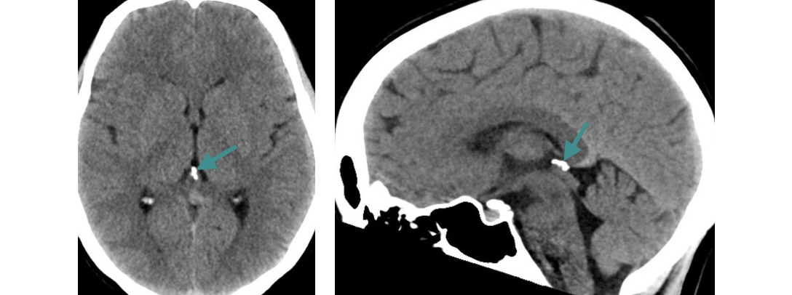

# :octicons-home-16:

Site de <strong>radiologie</strong> destiné aux étudiants en médecine L'objectif est de réviser l'<strong>EDN</strong> à partir de dossiers d'imagerie 
Le contenu est <strong>gratuit</strong> et s'articule autour de dossiers <a href="https://radiopaedia.org/?lang=gb">Radiopaedia</a>

!!! imago "[Exemple (scanner cérébral normal) : cliquer ici](https://radiopaedia.org/cases/35508/studies/36999?lang=gb){:target="_blank"}"
    * Radiopaedia permet de scroller les acquisitions présentées
    * Ici je liste les éléments sémiologiques importants
    * \+ image-clé légendée : calcification de l'épiphyse
    <figure markdown="span">
        {width="600"}
    </figure>
    !!! lumos ""
        :fire: Notion essentielle : calcification physiologique de l'épiphyse dès 10 ans
    
??? question "[Format quiz : cliquer ici, interpréter l'imagerie, puis afficher la réponse →](https://radiopaedia.org/cases/23526/studies/23629?lang=gb){:target="_blank"}"
    « Tout le monde se trompe, le génie comme le demeuré, et ce n'est pas l'erreur qui est dangereuse mais le fanatisme de celui qui croit qu'il ne se trompe pas. » _Éric-Emmanuel Schmitt_

<i>Alexandre Lefèvre, interne de radiologie à Lille </i><a href="mailto:lumosimago@gmail.com">lumosimago@gmail.com</a> 

<figure markdown="span">
  [{width="350"}](https://www.unitheque.com/imagerie-medicale-martingale-edn/la-martingale/ellipses/Livre/689796){:target="_blank"}
</figure>